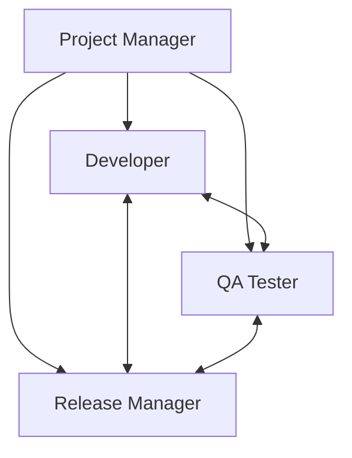
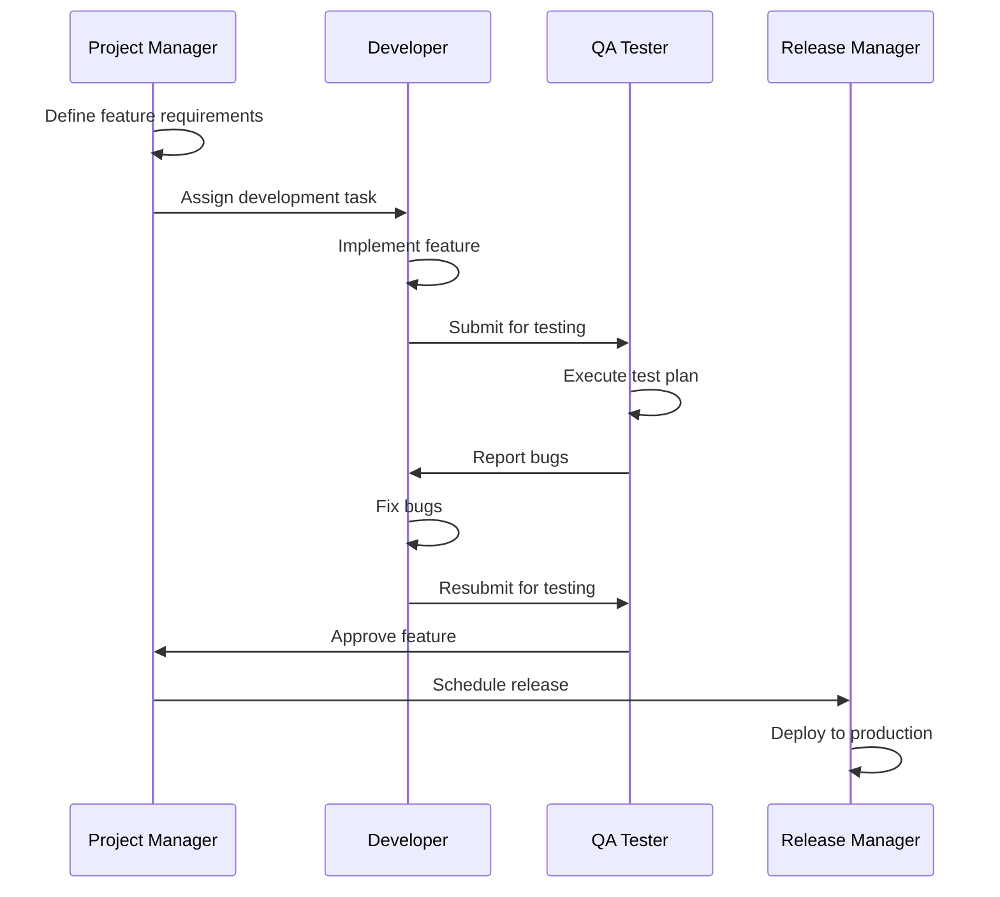
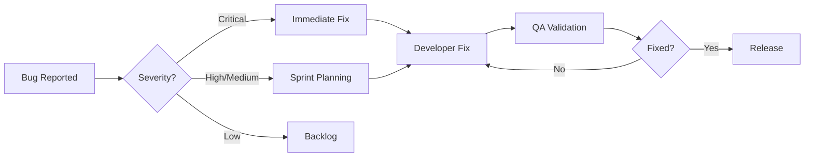
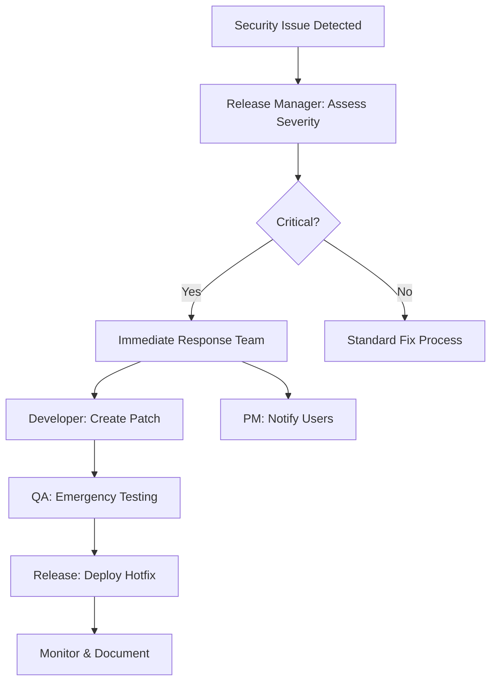

# RapidTriageME Agent Workflows

## 🎯 Overview

This document defines the collaborative workflows and interaction patterns between the four specialized agents managing the RapidTriageME browser debugging platform.

## 👥 Agent Team Structure



### Agent Roles Summary

| Agent | Primary Focus | Key Deliverables |
|-------|--------------|------------------|
| **Project Manager** | Strategy & Coordination | Roadmap, Sprint Plans, Stakeholder Updates |
| **Developer** | Implementation & Architecture | Code, APIs, Integrations |
| **QA Tester** | Quality & Reliability | Test Plans, Bug Reports, Quality Metrics |
| **Release Manager** | Deployment & Distribution | Releases, Packages, Documentation |

## 📋 Core Workflows

### 1. Feature Development Workflow



**Steps:**
1. PM defines feature requirements based on user needs and product strategy
2. DEV implements the feature across relevant components (MCP server, Chrome Extension, etc.)
3. TEST validates functionality, performance, and compatibility
4. DEV addresses any issues found during testing
5. PM approves the feature for release
6. REL coordinates deployment across all platforms

### 2. Bug Fix Workflow



**Priority Levels:**
- **Critical**: System down, data loss, security breach → Fix within 4 hours
- **High**: Major feature broken → Fix within 24 hours
- **Medium**: Feature partially broken → Fix in current sprint
- **Low**: Minor issues → Schedule in backlog

### 3. Release Workflow

```mermaid
gantt
    title Release Process Timeline
    dateFormat HH:mm
    section Preparation
    Code Freeze           :done, 09:00, 30m
    Final Testing        :active, 09:30, 2h
    Release Notes        :11:30, 1h
    section Deployment
    NPM Publish          :12:30, 30m
    Chrome Extension     :13:00, 1h
    Cloudflare Deploy    :14:00, 30m
    section Validation
    Smoke Testing        :14:30, 1h
    Monitoring           :15:30, 2h
```



**Release Checklist:**
- [ ] All tests passing (>80% coverage)
- [ ] Security scan completed
- [ ] Documentation updated
- [ ] Changelog prepared
- [ ] Version numbers bumped
- [ ] NPM packages ready
- [ ] Chrome Extension packaged
- [ ] Cloudflare configuration verified
- [ ] Rollback plan documented

### 4. IDE Integration Workflow

**New IDE Support Process:**
1. **PM**: Research IDE market share and user demand
2. **DEV**: Analyze IDE plugin architecture and MCP support
3. **DEV**: Implement integration following MCP protocol
4. **TEST**: Validate across IDE versions and platforms
5. **PM**: Create integration documentation
6. **REL**: Add to compatibility matrix and release

**Supported IDEs Status:**
| IDE | Status | Agent Owner |
|-----|--------|-------------|
| Cursor | ✅ Production | DEV |
| VS Code | ✅ Production | DEV |
| Claude Desktop | ✅ Production | DEV |
| Windsurf | 🔧 Testing | TEST |
| Zed | 🔧 Testing | TEST |
| JetBrains | 📅 Planned | PM |
| Neovim | 📅 Planned | PM |

### 5. Security Incident Response



**Response Times:**
- Critical vulnerabilities: 4-hour response
- High severity: 24-hour response
- Medium/Low: Next release cycle

## 🔄 Daily Operations

### Morning Sync (9:00 AM)
- **PM**: Reviews overnight metrics and user feedback
- **DEV**: Updates on current development tasks
- **TEST**: Reports on test execution status
- **REL**: Confirms deployment schedule

### Sprint Ceremonies

| Ceremony | Frequency | Participants | Duration |
|----------|-----------|--------------|----------|
| Sprint Planning | Bi-weekly | All | 2 hours |
| Daily Standup | Daily | All | 15 min |
| Code Review | Daily | DEV, TEST | 1 hour |
| Release Planning | Weekly | PM, REL | 30 min |
| Retrospective | Bi-weekly | All | 1 hour |

## 📊 Success Metrics & KPIs

### Project Manager KPIs
- Feature delivery rate: 5+ features/sprint
- Stakeholder satisfaction: >90%
- Documentation completeness: 100%
- User adoption rate: 20% MoM growth

### Developer KPIs
- Code quality: >80% test coverage
- API response time: <100ms
- Bug fix rate: 90% within SLA
- PR review time: <4 hours

### QA Tester KPIs
- Test automation: >70% coverage
- Defect escape rate: <5%
- Test execution time: <2 hours
- Critical bug detection: 100%

### Release Manager KPIs
- Deployment success rate: >95%
- Release frequency: Weekly
- Rollback rate: <2%
- Package download growth: 20% WoW

## 🚀 Current Sprint Focus

### Sprint 2025-W33 (Aug 12-23)

**Project Manager Tasks:**
- [ ] Finalize enterprise pricing model
- [ ] Coordinate with 3 IDE vendors for integration
- [ ] Prepare documentation for v1.1.0 release

**Developer Tasks:**
- [ ] Implement Safari extension support
- [ ] Optimize WebSocket performance (<5ms latency)
- [ ] Add memory profiling to Lighthouse audits

**QA Tester Tasks:**
- [ ] Complete E2E test suite for all IDEs
- [ ] Performance benchmark all MCP tools
- [ ] Security audit for authentication flow

**Release Manager Tasks:**
- [ ] Publish @yarlis/rapidtriage-mcp v1.0.0
- [ ] Publish @yarlis/rapidtriage-server v1.0.0
- [ ] Submit Chrome Extension v1.0.0 for review

## 🔧 Tool Stack

### Communication
- **Primary**: Discord (#rapidtriage-team)
- **Async**: GitHub Discussions
- **Video**: Google Meet / Zoom

### Project Management
- **Tracking**: GitHub Projects
- **Documentation**: MkDocs + GitHub Wiki
- **Time Tracking**: Toggl

### Development
- **IDE**: VS Code / Cursor
- **Version Control**: Git + GitHub
- **CI/CD**: GitHub Actions

### Monitoring
- **Errors**: Sentry
- **Analytics**: Cloudflare Analytics
- **Uptime**: Pingdom
- **Logs**: Cloudflare Logs

## 📝 Communication Templates

### Feature Announcement
```markdown
🚀 New Feature: [Feature Name]

**What's New:**
- [Key capability 1]
- [Key capability 2]

**How to Use:**
[Brief instructions]

**Documentation:** [Link]
**Feedback:** [GitHub Issue Link]
```

### Release Notes
```markdown
# RapidTriageME v[X.Y.Z]

## ✨ New Features
- Feature 1 (#PR)
- Feature 2 (#PR)

## 🐛 Bug Fixes
- Fix 1 (#Issue)
- Fix 2 (#Issue)

## 📚 Documentation
- Updated [Section]

## 💔 Breaking Changes
- Change description

## 📦 Installation
```npm
npm install @yarlis/rapidtriage-mcp@latest
```
```

## 🎯 Success Criteria

### Q3 2025 Goals
- [ ] 10,000+ weekly NPM downloads
- [ ] 5,000+ Chrome Extension users
- [ ] 1,000+ GitHub stars
- [ ] 10+ IDE integrations
- [ ] 50+ enterprise customers
- [ ] 99.9% uptime
- [ ] <100ms API response time
- [ ] Zero critical security issues

## 📅 Upcoming Milestones

| Date | Milestone | Owner |
|------|-----------|-------|
| Aug 15 | NPM Package Launch | REL |
| Aug 20 | Chrome Extension v1.0 | REL |
| Aug 30 | Enterprise Beta Program | PM |
| Sep 15 | Safari Extension | DEV |
| Sep 30 | Team Collaboration Features | DEV |
| Oct 15 | AI-Powered Analysis | PM |
| Oct 30 | v2.0 Planning | All |

---

**Last Updated**: August 9, 2025
**Next Review**: August 23, 2025
**Document Owner**: Project Manager Agent