# Data Flow Architecture

This document details how data flows through the RapidTriageME system, from browser events to AI assistant responses. Understanding these patterns is crucial for debugging, optimization, and extending the platform.

## Overview

RapidTriageME processes data through multiple interconnected flows:

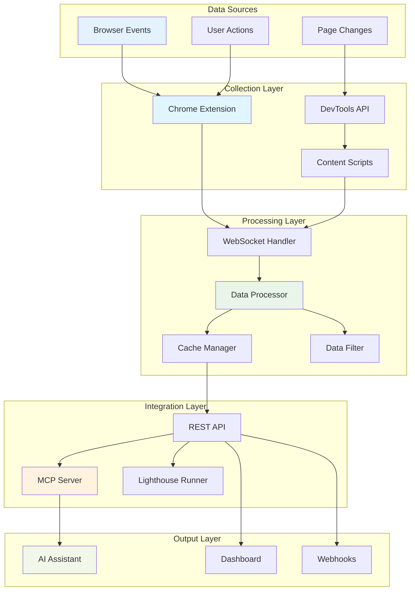

## Real-Time Data Flows

### Console Log Flow

Console messages flow from browser to AI assistant through this pipeline:

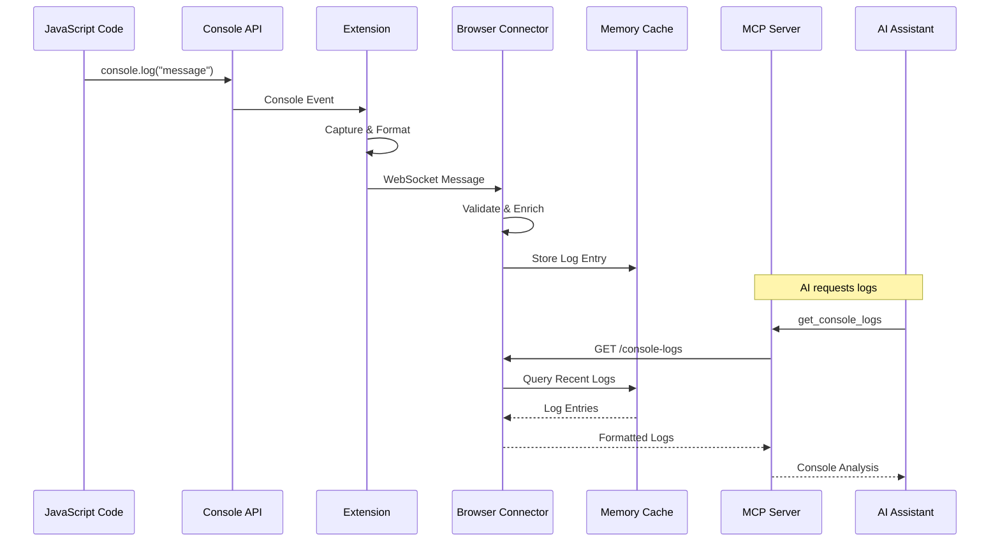

**Data Transformation:**
```javascript
// Raw console event
{
  level: "error",
  message: "TypeError: Cannot read property 'foo' of undefined",
  timestamp: 1704067200000,
  stack: "Error\n    at example.js:15:20"
}

// Processed log entry
{
  id: "log_abc123",
  level: "error",
  message: "TypeError: Cannot read property 'foo' of undefined",
  timestamp: 1704067200000,
  url: "https://example.com/page",
  source: "example.js:15:20",
  stack: ["Error", "    at example.js:15:20"],
  metadata: {
    userAgent: "Chrome/91.0",
    sessionId: "session_xyz789"
  }
}
```

### Network Request Flow

Network requests are captured and analyzed through this flow:

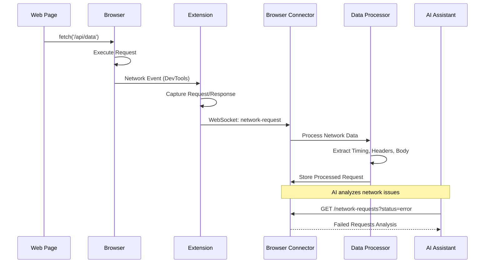

**Network Data Structure:**
```javascript
// Network request entry
{
  id: "req_def456",
  url: "https://api.example.com/data",
  method: "GET",
  status: 500,
  statusText: "Internal Server Error",
  timestamp: 1704067200000,
  duration: 2500, // milliseconds
  size: {
    request: 1024,
    response: 256
  },
  timing: {
    dns: 50,
    connect: 100,
    send: 10,
    wait: 2000,
    receive: 340
  },
  headers: {
    request: { "Content-Type": "application/json" },
    response: { "Content-Type": "application/json" }
  },
  body: {
    request: "{\"query\":\"test\"}",
    response: "{\"error\":\"Database connection failed\"}"
  }
}
```

### Screenshot Capture Flow

Screenshot requests follow this synchronous pattern:

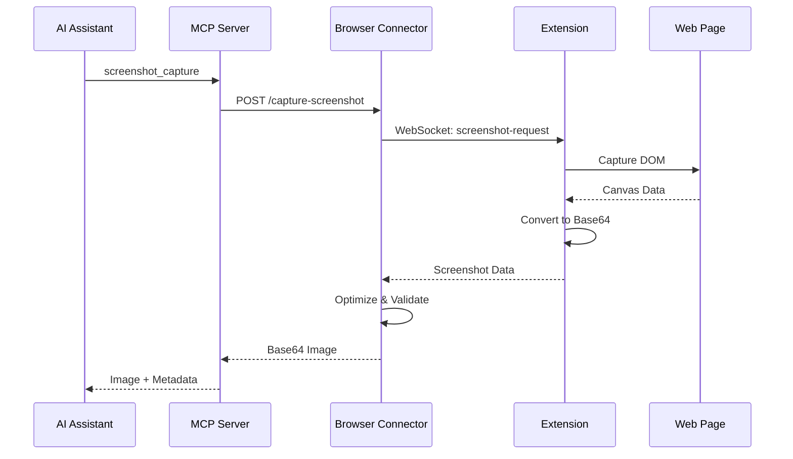

## Asynchronous Processing Patterns

### Event Buffering

High-frequency events are buffered to prevent overwhelming the system:

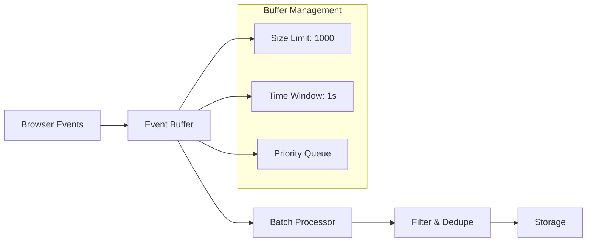

**Buffer Implementation:**
```javascript
class EventBuffer {
  constructor(options = {}) {
    this.maxSize = options.maxSize || 1000;
    this.flushInterval = options.flushInterval || 1000;
    this.buffer = [];
    this.flushTimer = null;
  }

  add(event) {
    this.buffer.push({
      ...event,
      bufferedAt: Date.now()
    });

    // Flush if buffer is full
    if (this.buffer.length >= this.maxSize) {
      this.flush();
    } else if (!this.flushTimer) {
      // Schedule flush
      this.flushTimer = setTimeout(() => {
        this.flush();
      }, this.flushInterval);
    }
  }

  flush() {
    if (this.buffer.length === 0) return;

    const events = this.buffer.splice(0, this.buffer.length);
    this.processEvents(events);
    
    if (this.flushTimer) {
      clearTimeout(this.flushTimer);
      this.flushTimer = null;
    }
  }
}
```

### Data Aggregation

Multiple data sources are aggregated for comprehensive analysis:

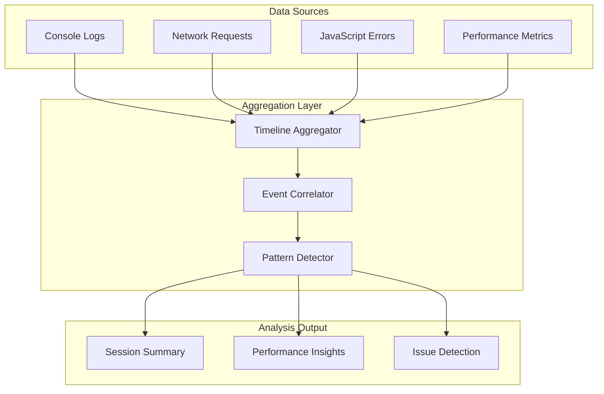

## Lighthouse Audit Flow

Lighthouse audits follow a specialized processing pipeline:

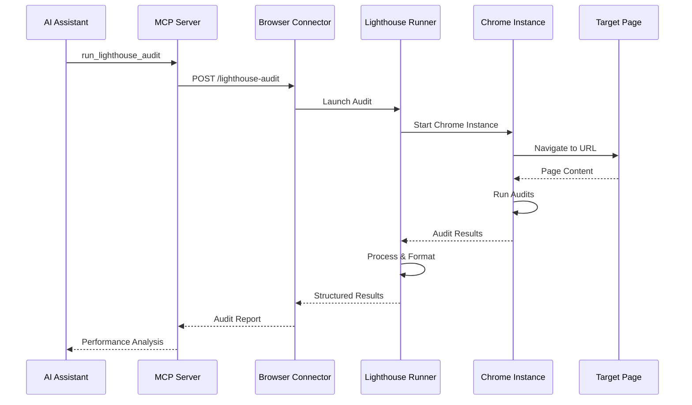

**Lighthouse Data Processing:**
```javascript
// Raw Lighthouse result processing
function processLighthouseResults(lhr) {
  return {
    url: lhr.finalUrl,
    timestamp: new Date(lhr.fetchTime).getTime(),
    
    // Core scores (0-100)
    scores: {
      performance: Math.round((lhr.categories.performance?.score || 0) * 100),
      accessibility: Math.round((lhr.categories.accessibility?.score || 0) * 100),
      bestPractices: Math.round((lhr.categories['best-practices']?.score || 0) * 100),
      seo: Math.round((lhr.categories.seo?.score || 0) * 100)
    },
    
    // Core Web Vitals
    metrics: {
      firstContentfulPaint: lhr.audits['first-contentful-paint']?.numericValue,
      largestContentfulPaint: lhr.audits['largest-contentful-paint']?.numericValue,
      cumulativeLayoutShift: lhr.audits['cumulative-layout-shift']?.numericValue,
      totalBlockingTime: lhr.audits['total-blocking-time']?.numericValue
    },
    
    // Opportunities for improvement
    opportunities: extractOpportunities(lhr.audits),
    
    // Diagnostics and issues
    diagnostics: extractDiagnostics(lhr.audits)
  };
}
```

## Error Handling and Recovery

### Connection Recovery

WebSocket connections implement automatic recovery:

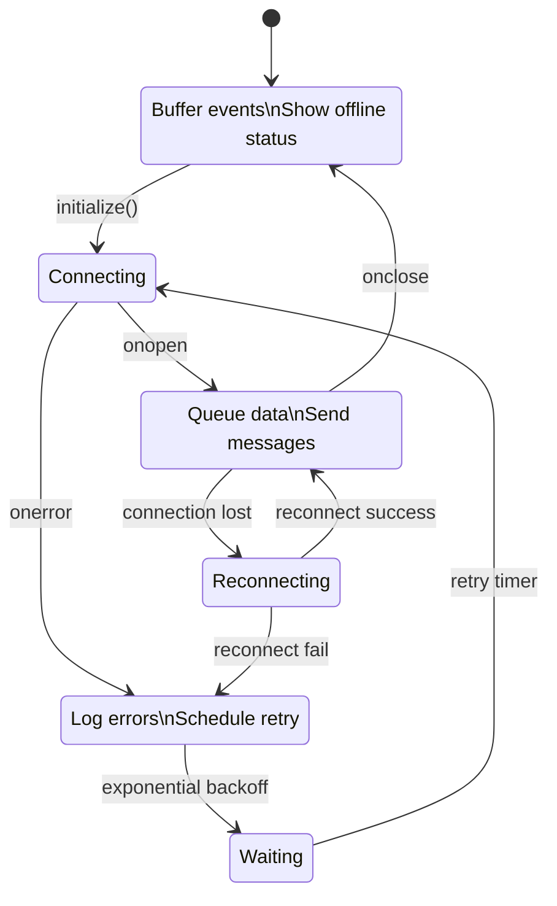

### Data Persistence

Critical data is persisted during connection issues:

```javascript
class DataPersistence {
  constructor() {
    this.offlineQueue = [];
    this.maxOfflineSize = 10000; // entries
    this.persistenceKey = 'rapidtriage_offline_data';
  }

  // Buffer data when offline
  bufferOfflineData(data) {
    this.offlineQueue.push({
      ...data,
      queuedAt: Date.now()
    });

    // Maintain size limits
    if (this.offlineQueue.length > this.maxOfflineSize) {
      this.offlineQueue = this.offlineQueue.slice(-this.maxOfflineSize);
    }

    // Persist to local storage
    this.persistToStorage();
  }

  // Sync when connection restored
  async syncOfflineData() {
    const queuedData = this.offlineQueue.splice(0);
    
    for (const data of queuedData) {
      try {
        await this.sendData(data);
      } catch (error) {
        // Re-queue failed items
        this.offlineQueue.unshift(data);
        break;
      }
    }

    this.persistToStorage();
  }
}
```

## Performance Optimization

### Data Compression

Large payloads are compressed before transmission:

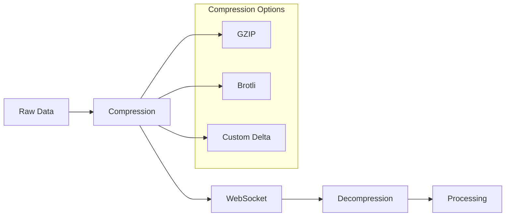

### Streaming Responses

Large datasets are streamed to prevent memory issues:

```javascript
// Streaming log retrieval
async function* streamConsoleLogs(options = {}) {
  const batchSize = options.batchSize || 100;
  let offset = 0;
  
  while (true) {
    const batch = await this.getLogsBatch(offset, batchSize);
    
    if (batch.length === 0) break;
    
    // Yield batch to consumer
    yield {
      logs: batch,
      offset,
      hasMore: batch.length === batchSize
    };
    
    offset += batch.length;
  }
}

// Usage in API endpoint
app.get('/console-logs/stream', async (req, res) => {
  res.writeHead(200, {
    'Content-Type': 'application/json',
    'Transfer-Encoding': 'chunked'
  });
  
  for await (const batch of streamConsoleLogs()) {
    res.write(JSON.stringify(batch) + '\n');
  }
  
  res.end();
});
```

## Data Security and Privacy

### Sensitive Data Filtering

Personal and sensitive information is filtered at multiple stages:

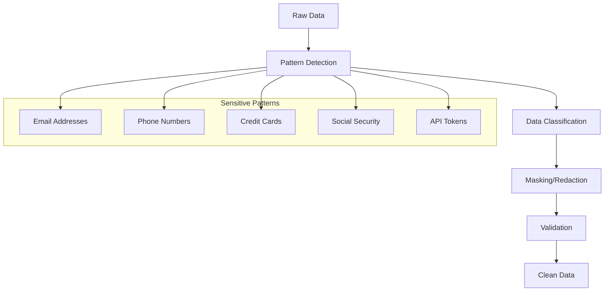

**Data Sanitization Pipeline:**
```javascript
class DataSanitizer {
  constructor() {
    this.patterns = {
      email: /\b[A-Za-z0-9._%+-]+@[A-Za-z0-9.-]+\.[A-Z|a-z]{2,}\b/g,
      phone: /\b\d{3}[-.]?\d{3}[-.]?\d{4}\b/g,
      creditCard: /\b\d{4}[\s-]?\d{4}[\s-]?\d{4}[\s-]?\d{4}\b/g,
      ssn: /\b\d{3}-?\d{2}-?\d{4}\b/g,
      apiKey: /\b[A-Za-z0-9]{32,}\b/g
    };
  }

  sanitize(data) {
    let sanitized = JSON.stringify(data);
    
    for (const [type, pattern] of Object.entries(this.patterns)) {
      sanitized = sanitized.replace(pattern, `[${type.toUpperCase()}_REDACTED]`);
    }
    
    return JSON.parse(sanitized);
  }
}
```

## Monitoring and Observability

### Flow Metrics

Key metrics are tracked throughout the data flow:

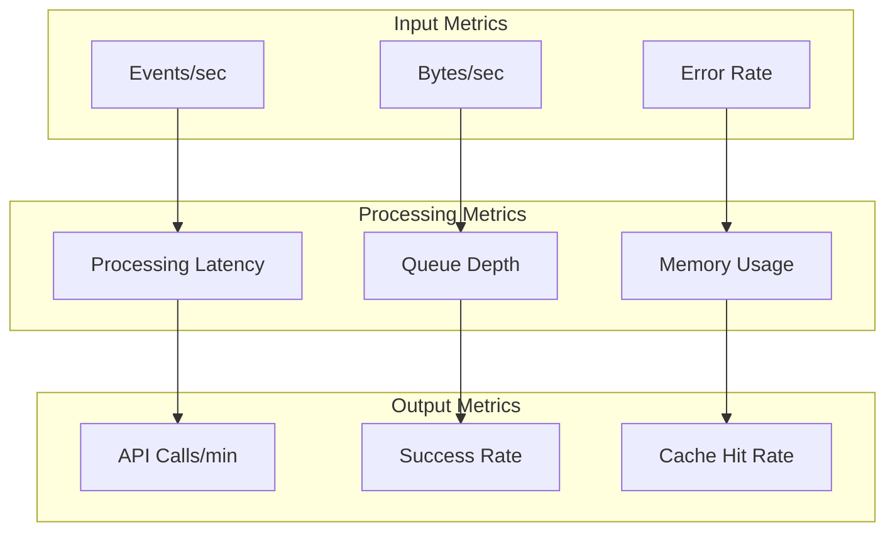

### Distributed Tracing

Requests are traced across all components:

```javascript
// Trace context propagation
class TraceContext {
  constructor(traceId = generateTraceId()) {
    this.traceId = traceId;
    this.spanId = generateSpanId();
    this.startTime = Date.now();
    this.events = [];
  }

  addEvent(name, data = {}) {
    this.events.push({
      name,
      timestamp: Date.now(),
      duration: Date.now() - this.startTime,
      data
    });
  }

  createChildSpan(name) {
    return new TraceContext(this.traceId)
      .setParentSpan(this.spanId)
      .setName(name);
  }
}

// Usage in data flow
const trace = new TraceContext();

// Extension
trace.addEvent('console_log_captured', { level: 'error' });

// Browser Connector
trace.addEvent('websocket_received');
trace.addEvent('data_processed');

// MCP Server
trace.addEvent('mcp_tool_executed', { tool: 'get_console_logs' });
```

This comprehensive data flow architecture ensures reliable, performant, and secure processing of browser debugging data from capture to AI analysis.

## Next Steps

- **[Component Details](components.md)** - Deep dive into component internals
- **[API Reference](../api/index.md)** - Detailed API documentation
- **[Performance Guide](../guides/performance.md)** - Optimization strategies