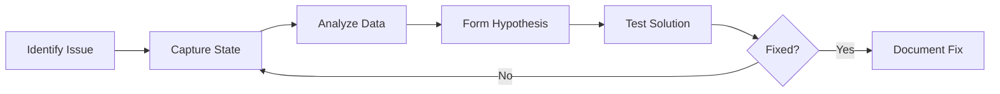
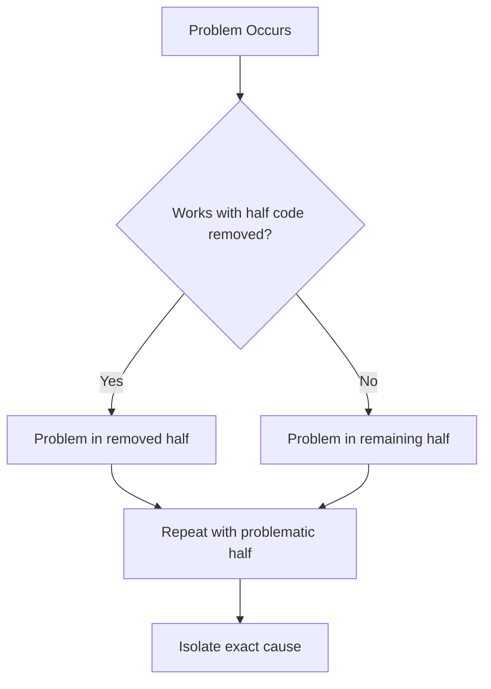

# Debugging Techniques Guide

## 🔍 Master browser debugging with AI assistance

Learn advanced debugging techniques using RapidTriageME's powerful browser automation and AI integration capabilities.

## Core Debugging Concepts

### The Debugging Workflow



## Essential Debugging Tools

### 1. Screenshot Capture

Capture visual state of your application at any moment:

```javascript
// AI Command Examples:
"Take a screenshot of the current page"
"Capture the error state on localhost:3000"
"Screenshot the modal dialog that appears after clicking submit"
```

**Advanced Options:**
- Full page capture
- Element-specific screenshots
- Mobile viewport simulation
- Before/after comparisons

### 2. Console Log Analysis

Monitor and analyze browser console output:

```javascript
// AI Command Examples:
"Show me all console errors"
"Get warning messages from the last 5 minutes"
"Find console logs related to API calls"
```

**Log Levels:**
- `error` - Critical issues
- `warn` - Potential problems
- `info` - Informational messages
- `debug` - Detailed debugging info
- `trace` - Stack traces

### 3. Network Request Monitoring

Track and analyze HTTP requests:

```javascript
// AI Command Examples:
"Show failed network requests"
"List all API calls to /api/users"
"Find slow requests taking over 1 second"
"Check for CORS errors"
```

**Network Analysis:**
- Request/response headers
- Status codes
- Timing information
- Payload inspection
- WebSocket messages

### 4. Performance Profiling

Identify performance bottlenecks:

```javascript
// AI Command Examples:
"Run performance audit"
"Check Core Web Vitals"
"Analyze JavaScript execution time"
"Find memory leaks"
```

## Debugging Scenarios

### Scenario 1: React Component Not Rendering

**Problem:** Component appears blank or doesn't update

**Debugging Steps:**

1. **Capture Visual State**
   ```
   "Take a screenshot of the component area"
   ```

2. **Check Console Errors**
   ```
   "Show any React errors in the console"
   ```

3. **Inspect Props/State**
   ```
   "Check React DevTools for component props"
   ```

4. **Network Analysis**
   ```
   "Are there any failed API calls?"
   ```

**Common Solutions:**
- Missing dependencies in useEffect
- Incorrect state updates
- API endpoint issues
- Conditional rendering bugs

### Scenario 2: API Integration Issues

**Problem:** Data not loading or updating

**Debugging Steps:**

1. **Monitor Network**
   ```
   "Show all API requests to the backend"
   ```

2. **Check Status Codes**
   ```
   "List any 4xx or 5xx responses"
   ```

3. **Inspect Payloads**
   ```
   "Show the request and response for POST /api/users"
   ```

4. **CORS Analysis**
   ```
   "Check for CORS errors"
   ```

**Common Solutions:**
- Authentication token issues
- CORS configuration
- Malformed request body
- Rate limiting

### Scenario 3: Performance Problems

**Problem:** Slow page load or interactions

**Debugging Steps:**

1. **Run Lighthouse Audit**
   ```
   "Perform full Lighthouse audit"
   ```

2. **Analyze Metrics**
   ```
   "What's the Largest Contentful Paint time?"
   ```

3. **Resource Analysis**
   ```
   "Find the largest JavaScript bundles"
   ```

4. **Runtime Performance**
   ```
   "Check for long-running scripts"
   ```

**Common Solutions:**
- Code splitting
- Image optimization
- Lazy loading
- Caching strategies

### Scenario 4: Form Validation Errors

**Problem:** Form submission fails silently

**Debugging Steps:**

1. **Capture Form State**
   ```
   "Screenshot the form after submission attempt"
   ```

2. **Console Validation**
   ```
   "Show validation errors in console"
   ```

3. **Network Inspection**
   ```
   "Check the form submission request"
   ```

4. **Event Tracking**
   ```
   "Monitor form submit events"
   ```

## Advanced Debugging Techniques

### 1. Automated Debugging Mode

Run comprehensive debugging workflow:

```javascript
// AI Command:
"Run full debug mode on this page"

// This executes:
1. Screenshot capture
2. Console log collection
3. Network request analysis
4. Performance metrics
5. Accessibility check
6. Security scan
```

### 2. Comparative Debugging

Compare working vs broken states:

```javascript
// AI Commands:
"Compare screenshots before and after clicking submit"
"Diff network requests between working and broken versions"
"Show console differences between two page loads"
```

### 3. Time-Travel Debugging

Analyze historical data:

```javascript
// AI Commands:
"Show console logs from the last 10 minutes"
"Get network requests from before the error occurred"
"Track user interactions leading to the bug"
```

### 4. Cross-Browser Testing

Debug browser-specific issues:

```javascript
// AI Commands:
"Test in Chrome, Firefox, and Safari"
"Check for browser-specific console errors"
"Compare rendering across browsers"
```

## Debugging Patterns

### Pattern 1: Binary Search Debugging

Narrow down the problem systematically:



### Pattern 2: Hypothesis-Driven Debugging

1. **Form hypothesis**: "The issue is caused by X"
2. **Design test**: "If X is the cause, then Y should happen"
3. **Execute test**: Use RapidTriageME tools
4. **Analyze results**: Confirm or refute hypothesis
5. **Iterate**: Form new hypothesis based on findings

### Pattern 3: Systematic Elimination

```javascript
// Checklist approach:
const debugChecklist = [
  "Check browser console for errors",
  "Verify network requests succeed",
  "Confirm data structure is correct",
  "Test with minimal reproduction",
  "Check browser compatibility",
  "Review recent code changes"
];
```

## Debugging Commands Reference

### Quick Commands

| Command | Purpose |
|---------|---------|
| `"debug"` | Run full debug suite |
| `"screenshot"` | Capture current state |
| `"console"` | Get console logs |
| `"network"` | Show network activity |
| `"audit"` | Run performance audit |
| `"errors"` | Show all errors |

### Detailed Commands

```javascript
// Console Analysis
"Show console errors with stack traces"
"Filter console logs by 'user' keyword"
"Get console timing information"

// Network Analysis
"Show POST requests with 500 status"
"Find requests taking over 2 seconds"
"List WebSocket connections"

// Performance
"Measure First Contentful Paint"
"Check JavaScript bundle sizes"
"Analyze render-blocking resources"

// Visual Debugging
"Screenshot with device frame"
"Capture element #user-form"
"Take screenshots at breakpoints"
```

## Debugging Best Practices

### 1. Systematic Approach

- ✅ **Reproduce consistently** before debugging
- ✅ **Document steps** to reproduce
- ✅ **Isolate variables** one at a time
- ✅ **Keep a debugging log** of attempts

### 2. Use AI Effectively

```javascript
// Good AI prompts:
"Debug why the login form returns 401 error"
"Help me find what's causing the memory leak"
"Analyze why the page loads slowly on mobile"

// Include context:
"After upgrading React, the component stopped rendering"
"Users report errors only on Safari"
"The issue happens after 5 minutes of usage"
```

### 3. Preventive Debugging

- Add comprehensive error boundaries
- Implement detailed logging
- Set up monitoring and alerts
- Write debugging documentation

### 4. Team Debugging

Share debugging context:

```javascript
// Create debugging report
const debugReport = {
  timestamp: new Date(),
  screenshot: "base64...",
  console: [...logs],
  network: [...requests],
  steps: ["Step 1", "Step 2"],
  hypothesis: "Possible cause...",
  environment: {
    browser: "Chrome 120",
    os: "macOS 14",
    viewport: "1920x1080"
  }
};
```

## Common Issues and Solutions

### Issue: "Cannot read property of undefined"

```javascript
// Debugging approach:
1. "Show the exact error with stack trace"
2. "Screenshot when error occurs"
3. "Check the data structure being accessed"
4. "Verify API response format"

// Common fixes:
- Optional chaining: obj?.property
- Default values: const { data = {} } = response
- Null checks: if (data && data.user)
- Type validation: PropTypes or TypeScript
```

### Issue: "Maximum update depth exceeded"

```javascript
// Debugging approach:
1. "Find React rendering loops"
2. "Check useEffect dependencies"
3. "Monitor component re-renders"

// Common fixes:
- Fix dependency arrays
- Memoize expensive computations
- Use useCallback for functions
- Prevent state updates in render
```

### Issue: "CORS blocked request"

```javascript
// Debugging approach:
1. "Show the exact CORS error"
2. "Check request and response headers"
3. "Verify allowed origins"

// Common fixes:
- Configure server CORS headers
- Use proxy in development
- Check credentials flag
- Verify API endpoint URL
```

## Debugging Workflow Automation

### Create Custom Workflows

```javascript
// .rapidtriage/workflows/e2e-debug.js
module.exports = {
  name: "E2E Debug Workflow",
  steps: [
    {
      name: "Initial State",
      tool: "screenshot_capture",
      params: { fullPage: true }
    },
    {
      name: "Clear Errors",
      tool: "get_console_logs",
      params: { level: "error", clear: true }
    },
    {
      name: "User Journey",
      sequence: [
        { action: "navigate", url: "/login" },
        { action: "fill", selector: "#email", value: "test@example.com" },
        { action: "fill", selector: "#password", value: "password" },
        { action: "click", selector: "#submit" },
        { action: "wait", time: 2000 }
      ]
    },
    {
      name: "Capture Results",
      parallel: [
        { tool: "screenshot_capture" },
        { tool: "get_console_logs" },
        { tool: "get_network_requests", params: { failed: true } }
      ]
    },
    {
      name: "Analysis",
      tool: "run_lighthouse_audit",
      params: { categories: ["performance", "accessibility"] }
    }
  ]
};
```

### Use Workflow in IDE

```
"Run the E2E debug workflow"
"Execute custom debugging sequence for checkout flow"
```

## Debugging Tools Integration

### Browser DevTools Enhancement

RapidTriageME enhances native DevTools:

- **Auto-capture**: Automatically captures state on errors
- **Time markers**: Marks timeline when issues occur
- **Correlation**: Links console errors to network requests
- **Export**: Saves debugging session for sharing

### External Tools Integration

Works alongside:
- **Sentry**: Error tracking
- **LogRocket**: Session replay
- **Datadog**: APM monitoring
- **New Relic**: Performance monitoring

## Learning Resources

### Debugging Tutorials

1. **Basic Debugging**: Understanding browser DevTools
2. **Advanced Techniques**: Memory profiling and performance
3. **Framework-Specific**: React, Vue, Angular debugging
4. **API Debugging**: REST, GraphQL, WebSocket

### Practice Scenarios

Try these debugging challenges:

1. **Challenge 1**: Find why a button click doesn't work
2. **Challenge 2**: Debug slow page load
3. **Challenge 3**: Fix data not updating
4. **Challenge 4**: Resolve authentication issues

## Next Steps

- 🚀 [IDE Integration](ide-integration.md) - Set up your environment
- ⚡ [Performance Guide](performance.md) - Optimize applications
- 🔒 [Security Guide](security.md) - Secure debugging practices
- 📊 [API Reference](/api) - Complete tool documentation

## Support

Having debugging issues?

- 📖 [Documentation](https://docs.rapidtriage.me)
- 💬 [Discord Community](https://discord.gg/rapidtriage)
- 🐛 [Report Issues](https://github.com/YarlisAISolutions/rapidtriageME/issues)
- 📧 [Email Support](mailto:support@rapidtriage.me)