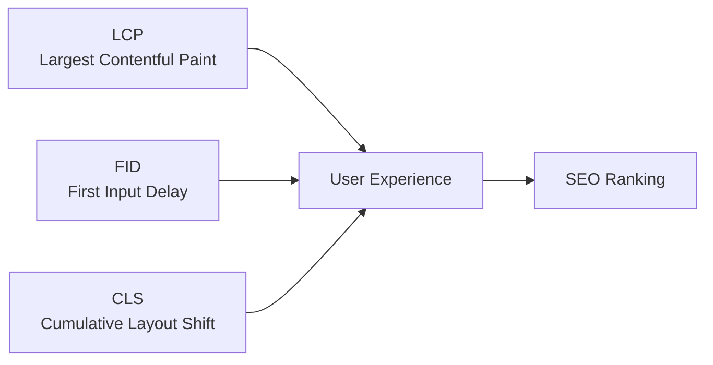
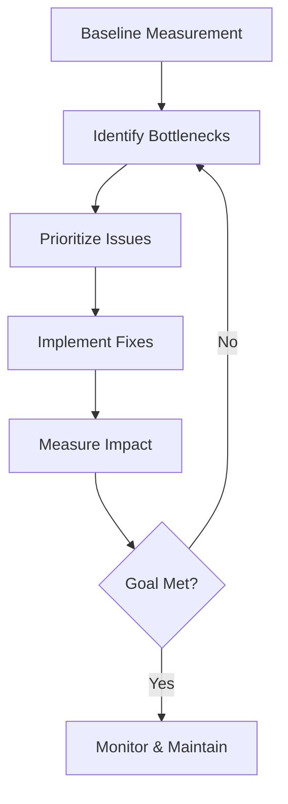

# Performance Optimization Guide

## ⚡ Optimize web performance using Lighthouse and AI insights

Master performance optimization with RapidTriageME's comprehensive auditing and monitoring capabilities.

## Performance Metrics Overview

### Core Web Vitals



| Metric | Good | Needs Improvement | Poor |
|--------|------|-------------------|------|
| **LCP** | ≤2.5s | ≤4.0s | >4.0s |
| **FID** | ≤100ms | ≤300ms | >300ms |
| **CLS** | ≤0.1 | ≤0.25 | >0.25 |

## Performance Auditing

### 1. Run Comprehensive Audit

```javascript
// AI Command:
"Run full Lighthouse performance audit"

// Returns:
- Performance score (0-100)
- Core Web Vitals
- Opportunities for improvement
- Diagnostics
- Passed audits
```

### 2. Specific Performance Checks

```javascript
// AI Commands:
"Check First Contentful Paint time"
"Analyze JavaScript execution time"
"Find render-blocking resources"
"Measure Time to Interactive"
"Check Total Blocking Time"
```

### 3. Resource Analysis

```javascript
// AI Commands:
"List largest JavaScript bundles"
"Find unoptimized images"
"Check for unused CSS"
"Analyze third-party script impact"
```

## Performance Optimization Strategies

### 1. JavaScript Optimization

#### Bundle Size Reduction

```javascript
// Before: Large bundle
import moment from 'moment'; // 67KB
import _ from 'lodash'; // 71KB

// After: Tree-shaking and alternatives
import { format } from 'date-fns'; // 2KB
import debounce from 'lodash/debounce'; // 1KB
```

#### Code Splitting

```javascript
// Lazy load routes
const Dashboard = lazy(() => import('./Dashboard'));

// Lazy load heavy components
const Chart = lazy(() => import('./Chart'));

// Conditional loading
if (user.needsAnalytics) {
  import('./analytics').then(module => {
    module.init();
  });
}
```

#### Performance Monitoring

```javascript
// AI Commands for JS performance:
"Identify long-running scripts"
"Find JavaScript memory leaks"
"Check for excessive DOM manipulation"
"Analyze React re-renders"
```

### 2. Image Optimization

#### Modern Format Usage

```html
<!-- Before: Large JPEG -->
 <!-- 500KB -->

<!-- After: Modern formats with fallback -->
<picture>
  <source srcset="hero.avif" type="image/avif" /> <!-- 150KB -->
  <source srcset="hero.webp" type="image/webp" /> <!-- 200KB -->
   <!-- Fallback -->
</picture>
```

#### Lazy Loading

```html
<!-- Native lazy loading -->


<!-- Intersection Observer for advanced control -->
<script>
const images = document.querySelectorAll('[data-src]');
const imageObserver = new IntersectionObserver((entries) => {
  entries.forEach(entry => {
    if (entry.isIntersecting) {
      entry.target.src = entry.target.dataset.src;
      imageObserver.unobserve(entry.target);
    }
  });
});
images.forEach(img => imageObserver.observe(img));
</script>
```

#### AI Commands for Images

```javascript
"Find images without proper sizing"
"Check for missing image dimensions"
"List images over 100KB"
"Analyze image format usage"
```

### 3. CSS Optimization

#### Critical CSS

```html
<!-- Inline critical CSS -->
<style>
  /* Above-the-fold styles */
  .hero { background: #000; height: 100vh; }
  .nav { position: fixed; top: 0; }
</style>

<!-- Lazy load non-critical CSS -->
<link rel="preload" href="styles.css" as="style" onload="this.onload=null;this.rel='stylesheet'">
```

#### Remove Unused CSS

```javascript
// PurgeCSS configuration
module.exports = {
  content: ['./src/**/*.{js,jsx,ts,tsx}'],
  css: ['./src/**/*.css'],
  safelist: ['dynamic-class', /^modal-/]
};
```

#### AI Commands for CSS

```javascript
"Find unused CSS rules"
"Check CSS file sizes"
"Identify render-blocking stylesheets"
"Analyze CSS complexity"
```

### 4. Network Optimization

#### Resource Hints

```html
<!-- DNS Prefetch -->
<link rel="dns-prefetch" href="//api.example.com">

<!-- Preconnect -->
<link rel="preconnect" href="https://fonts.googleapis.com">

<!-- Prefetch -->
<link rel="prefetch" href="/next-page.html">

<!-- Preload -->
<link rel="preload" href="/font.woff2" as="font" crossorigin>
```

#### Caching Strategy

```javascript
// Service Worker caching
self.addEventListener('fetch', (event) => {
  event.respondWith(
    caches.match(event.request).then((response) => {
      return response || fetch(event.request).then((response) => {
        return caches.open('v1').then((cache) => {
          cache.put(event.request, response.clone());
          return response;
        });
      });
    })
  );
});
```

#### AI Commands for Network

```javascript
"Analyze cache hit rates"
"Find resources without caching headers"
"Check for redundant requests"
"Monitor WebSocket performance"
```

## Performance Monitoring

### 1. Real User Monitoring (RUM)

```javascript
// Collect performance metrics
const perfData = {
  lcp: 0,
  fid: 0,
  cls: 0
};

// Largest Contentful Paint
new PerformanceObserver((list) => {
  const entries = list.getEntries();
  const lastEntry = entries[entries.length - 1];
  perfData.lcp = lastEntry.renderTime || lastEntry.loadTime;
}).observe({ type: 'largest-contentful-paint', buffered: true });

// First Input Delay
new PerformanceObserver((list) => {
  const entries = list.getEntries();
  entries.forEach((entry) => {
    perfData.fid = entry.processingStart - entry.startTime;
  });
}).observe({ type: 'first-input', buffered: true });

// Cumulative Layout Shift
new PerformanceObserver((list) => {
  let cls = 0;
  list.getEntries().forEach((entry) => {
    if (!entry.hadRecentInput) {
      cls += entry.value;
    }
  });
  perfData.cls = cls;
}).observe({ type: 'layout-shift', buffered: true });
```

### 2. Synthetic Monitoring

```javascript
// AI Commands for monitoring:
"Set up performance monitoring"
"Track Core Web Vitals over time"
"Alert on performance regression"
"Compare performance across deployments"
```

### 3. Performance Budgets

```javascript
// webpack.config.js
module.exports = {
  performance: {
    maxAssetSize: 244000, // 244KB
    maxEntrypointSize: 244000,
    hints: 'error',
    assetFilter: (assetFilename) => {
      return !assetFilename.endsWith('.map');
    }
  }
};
```

## Framework-Specific Optimizations

### React Performance

```javascript
// 1. Memoization
const ExpensiveComponent = memo(({ data }) => {
  return <div>{/* Complex rendering */}</div>;
});

// 2. useMemo for expensive computations
const filteredData = useMemo(() => {
  return data.filter(item => item.active);
}, [data]);

// 3. useCallback for function stability
const handleClick = useCallback(() => {
  // Handle click
}, [dependency]);

// 4. Virtual scrolling for long lists
import { FixedSizeList } from 'react-window';

const List = ({ items }) => (
  <FixedSizeList
    height={600}
    itemCount={items.length}
    itemSize={50}
    width="100%"
  >
    {({ index, style }) => (
      <div style={style}>{items[index]}</div>
    )}
  </FixedSizeList>
);
```

### Vue Performance

```javascript
// 1. Lazy loading components
const UserProfile = () => import('./UserProfile.vue');

// 2. Keep-alive for component caching
<keep-alive>
  <component :is="currentComponent" />
</keep-alive>

// 3. v-once for static content
<div v-once>
  {{ staticContent }}
</div>

// 4. Computed properties for derived state
computed: {
  filteredList() {
    return this.items.filter(item => item.active);
  }
}
```

### Angular Performance

```typescript
// 1. OnPush change detection
@Component({
  changeDetection: ChangeDetectionStrategy.OnPush
})

// 2. TrackBy for lists
trackByFn(index: number, item: any) {
  return item.id;
}

// 3. Lazy loading modules
const routes: Routes = [
  {
    path: 'admin',
    loadChildren: () => import('./admin/admin.module').then(m => m.AdminModule)
  }
];

// 4. Pure pipes for transformations
@Pipe({ name: 'filter', pure: true })
```

## Performance Testing

### 1. Load Testing

```javascript
// AI Commands:
"Simulate 100 concurrent users"
"Test performance under heavy load"
"Find breaking point of the application"
"Measure response times under stress"
```

### 2. Performance Regression Testing

```javascript
// CI/CD Integration
{
  "scripts": {
    "perf:test": "lighthouse https://staging.example.com --output json --output-path ./lighthouse.json",
    "perf:assert": "node assert-performance.js"
  }
}

// assert-performance.js
const results = require('./lighthouse.json');
const { performance } = results.categories;

if (performance.score < 0.9) {
  console.error(`Performance score ${performance.score} is below threshold`);
  process.exit(1);
}
```

### 3. A/B Testing Performance

```javascript
// Compare performance of different implementations
"Compare performance of old vs new checkout flow"
"Measure impact of lazy loading on LCP"
"Test performance with and without service worker"
```

## Performance Debugging

### Common Performance Issues

#### 1. Slow Initial Load

```javascript
// Debugging steps:
"Check bundle size and splitting"
"Analyze critical rendering path"
"Find render-blocking resources"
"Check server response time"

// Solutions:
- Code splitting
- Preloading critical resources
- CDN implementation
- Server-side rendering
```

#### 2. Janky Scrolling

```javascript
// Debugging steps:
"Profile scrolling performance"
"Check for layout thrashing"
"Find expensive paint operations"
"Analyze composite layers"

// Solutions:
- Use CSS transforms
- Implement virtual scrolling
- Debounce scroll handlers
- Use will-change property
```

#### 3. Memory Leaks

```javascript
// Debugging steps:
"Monitor memory usage over time"
"Check for detached DOM nodes"
"Find event listener leaks"
"Analyze closure retention"

// Solutions:
- Remove event listeners
- Clear timers and intervals
- Weak references for caches
- Proper component cleanup
```

## Performance Optimization Workflow

### Step-by-Step Process



### AI-Assisted Workflow

```javascript
// 1. Initial audit
"Run comprehensive performance audit"

// 2. Analysis
"What are the top 3 performance issues?"

// 3. Solutions
"How can I improve Largest Contentful Paint?"

// 4. Implementation
"Help me implement lazy loading for images"

// 5. Verification
"Measure performance improvement after changes"
```

## Performance Checklist

### Pre-Launch Checklist

- [ ] **Images optimized** - WebP/AVIF, proper sizing, lazy loading
- [ ] **JavaScript bundled** - Code splitting, tree shaking, minification
- [ ] **CSS optimized** - Critical CSS inlined, unused CSS removed
- [ ] **Fonts optimized** - Subset, preload, font-display: swap
- [ ] **Caching configured** - Browser cache, CDN, service worker
- [ ] **Compression enabled** - Gzip/Brotli for text assets
- [ ] **HTTP/2 enabled** - Multiplexing, server push
- [ ] **Performance budget set** - Size limits, metric thresholds

### Monitoring Checklist

- [ ] **RUM implemented** - Real user metrics collection
- [ ] **Alerts configured** - Performance regression alerts
- [ ] **Regular audits** - Weekly/monthly Lighthouse runs
- [ ] **A/B testing** - Performance impact measurement
- [ ] **Competitive analysis** - Benchmark against competitors

## Advanced Topics

### 1. Web Workers

```javascript
// Offload heavy computations
const worker = new Worker('worker.js');

worker.postMessage({ cmd: 'process', data: largeDataset });

worker.onmessage = (e) => {
  console.log('Processing complete:', e.data);
};

// worker.js
self.onmessage = (e) => {
  if (e.data.cmd === 'process') {
    const result = expensiveOperation(e.data.data);
    self.postMessage(result);
  }
};
```

### 2. WebAssembly

```javascript
// High-performance computations
WebAssembly.instantiateStreaming(fetch('compute.wasm'))
  .then(result => {
    const compute = result.instance.exports.compute;
    const result = compute(data);
  });
```

### 3. Edge Computing

```javascript
// Cloudflare Workers example
addEventListener('fetch', event => {
  event.respondWith(handleRequest(event.request));
});

async function handleRequest(request) {
  // Cache at edge
  const cache = caches.default;
  const cached = await cache.match(request);
  
  if (cached) {
    return cached;
  }
  
  const response = await fetch(request);
  event.waitUntil(cache.put(request, response.clone()));
  
  return response;
}
```

## Tools and Resources

### Performance Tools

- **Lighthouse** - Comprehensive auditing
- **WebPageTest** - Detailed performance testing
- **Chrome DevTools** - Performance profiling
- **GTmetrix** - Performance monitoring
- **Calibre** - Performance tracking

### AI Commands Reference

```javascript
// Quick performance checks
"performance" - Run basic audit
"slow" - Find slow elements
"optimize" - Get optimization suggestions

// Detailed analysis
"audit performance with focus on mobile"
"compare performance before and after deployment"
"track performance metrics for the last hour"

// Specific optimizations
"optimize images on this page"
"reduce JavaScript bundle size"
"improve Time to Interactive"
```

## Next Steps

- 🔍 [Debugging Guide](debugging.md) - Debug performance issues
- 🔒 [Security Guide](security.md) - Secure optimizations
- 🚀 [IDE Integration](ide-integration.md) - Set up tools
- 📊 [API Reference](/api) - Performance APIs

## Support

Need performance help?

- 📖 [Documentation](https://docs.rapidtriage.me)
- 💬 [Discord Community](https://discord.gg/rapidtriage)
- 🐛 [Report Issues](https://github.com/YarlisAISolutions/rapidtriageME/issues)
- 📧 [Email Support](mailto:support@rapidtriage.me)