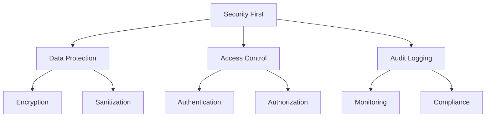

# Security & Privacy Guide

## 🔒 Secure your debugging setup and protect sensitive data

Learn how to use RapidTriageME securely while protecting sensitive information and maintaining privacy.

## Security Overview

### Security Principles



## Data Protection

### 1. Sensitive Data Handling

#### Automatic Redaction

RapidTriageME automatically redacts sensitive information:

```javascript
// Automatically redacted patterns:
- Credit card numbers: **** **** **** 1234
- SSN: ***-**-1234
- API keys: sk_live_****
- Passwords: ********
- Email addresses: u***@example.com (configurable)
```

#### Manual Redaction

```javascript
// AI Commands:
"Capture screenshot but redact user data"
"Get console logs with PII removed"
"Show network requests without auth headers"
```

#### Configuration

```json
// ~/.rapidtriage/security.json
{
  "redaction": {
    "enabled": true,
    "patterns": [
      { "type": "credit_card", "enabled": true },
      { "type": "ssn", "enabled": true },
      { "type": "email", "enabled": false },
      { "type": "phone", "enabled": true },
      { "type": "custom", "pattern": "api_key_.*", "replacement": "[REDACTED]" }
    ],
    "fields": [
      "password",
      "secret",
      "token",
      "apiKey",
      "authorization"
    ]
  }
}
```

### 2. Data Storage

#### Local Storage Security

```javascript
// Data is stored locally by default
const storageConfig = {
  location: "~/.rapidtriage/data",
  encryption: true,
  retention: "7d", // Auto-delete after 7 days
  maxSize: "100MB"
};
```

#### Encryption at Rest

```bash
# Enable encryption for stored data
rapidtriage-server --encrypt-storage

# Set encryption key (use environment variable)
export RAPIDTRIAGE_ENCRYPTION_KEY="your-256-bit-key"
```

### 3. Data Transmission

#### Secure Communication

```javascript
// TLS/SSL for all connections
const serverConfig = {
  ssl: {
    enabled: true,
    cert: "/path/to/cert.pem",
    key: "/path/to/key.pem",
    minVersion: "TLSv1.2"
  }
};
```

#### Local-Only Mode

```bash
# Restrict to localhost only
rapidtriage-server --local-only

# Block external connections
rapidtriage-server --host 127.0.0.1 --no-external
```

## Access Control

### 1. Authentication

#### Token-Based Auth

```javascript
// Generate access token
rapidtriage-server --generate-token

// Use token in configuration
{
  "auth": {
    "type": "token",
    "token": "rt_live_abc123...",
    "expires": "2025-12-31"
  }
}
```

#### OAuth Integration

```javascript
// OAuth configuration
{
  "auth": {
    "type": "oauth",
    "provider": "github",
    "clientId": "your-client-id",
    "allowedUsers": ["user1", "user2"],
    "allowedOrgs": ["your-org"]
  }
}
```

### 2. Authorization

#### Role-Based Access

```javascript
// Define roles and permissions
{
  "roles": {
    "admin": {
      "permissions": ["*"]
    },
    "developer": {
      "permissions": [
        "screenshot:capture",
        "console:read",
        "network:read",
        "audit:run"
      ]
    },
    "viewer": {
      "permissions": [
        "screenshot:view",
        "console:read"
      ]
    }
  }
}
```

#### IP Whitelisting

```javascript
// Restrict access by IP
{
  "security": {
    "ipWhitelist": [
      "192.168.1.0/24",
      "10.0.0.0/8",
      "::1"
    ],
    "blockPublicAccess": true
  }
}
```

### 3. Session Management

```javascript
// Session configuration
{
  "sessions": {
    "timeout": "30m",
    "maxConcurrent": 5,
    "requireReauth": true,
    "logActivity": true
  }
}
```

## Privacy Protection

### 1. User Data Privacy

#### GDPR Compliance

```javascript
// Privacy-compliant configuration
{
  "privacy": {
    "gdpr": {
      "enabled": true,
      "consentRequired": true,
      "dataRetention": "30d",
      "allowDeletion": true,
      "anonymizeData": true
    }
  }
}
```

#### Data Minimization

```javascript
// Collect only necessary data
{
  "collection": {
    "minimal": true,
    "exclude": [
      "userData",
      "personalInfo",
      "trackingData"
    ],
    "include": [
      "errors",
      "performance"
    ]
  }
}
```

### 2. Screenshot Privacy

#### Blur Sensitive Areas

```javascript
// AI Commands:
"Take screenshot with blurred user data"
"Capture page but blur all text inputs"
"Screenshot with faces blurred"

// Configuration:
{
  "screenshot": {
    "privacy": {
      "blurInputs": true,
      "blurFaces": true,
      "blurEmails": true,
      "customBlur": ["[data-sensitive]", ".private"]
    }
  }
}
```

#### Exclude Elements

```javascript
// Exclude sensitive elements from screenshots
{
  "screenshot": {
    "exclude": [
      "#credit-card-form",
      ".user-profile",
      "[data-private='true']"
    ]
  }
}
```

### 3. Network Privacy

#### Header Filtering

```javascript
// Remove sensitive headers
{
  "network": {
    "redactHeaders": [
      "Authorization",
      "Cookie",
      "X-API-Key",
      "X-Auth-Token"
    ],
    "redactParams": [
      "password",
      "token",
      "secret"
    ]
  }
}
```

#### Request Filtering

```javascript
// Exclude sensitive endpoints
{
  "network": {
    "exclude": [
      "/api/auth/*",
      "/api/payment/*",
      "*/sensitive/*"
    ]
  }
}
```

## Security Best Practices

### 1. Development Environment

#### Separate Environments

```javascript
// Use different configs for dev/prod
const config = process.env.NODE_ENV === 'production' 
  ? require('./config.prod.json')
  : require('./config.dev.json');

// Dev config (relaxed security)
{
  "security": {
    "level": "development",
    "allowInsecure": true,
    "verboseLogging": true
  }
}

// Prod config (strict security)
{
  "security": {
    "level": "production",
    "requireHttps": true,
    "minimalLogging": true
  }
}
```

#### Secure Defaults

```javascript
// Secure by default configuration
{
  "defaults": {
    "encryption": true,
    "authentication": true,
    "redaction": true,
    "localOnly": true,
    "autoDelete": true
  }
}
```

### 2. Team Collaboration

#### Shared Security Policies

```javascript
// Team security policy
{
  "team": {
    "name": "YourTeam",
    "securityPolicy": {
      "requireMfa": true,
      "passwordPolicy": {
        "minLength": 12,
        "requireSpecialChar": true,
        "rotation": "90d"
      },
      "dataClassification": {
        "public": ["screenshots"],
        "internal": ["logs", "metrics"],
        "confidential": ["user_data", "api_keys"]
      }
    }
  }
}
```

#### Audit Logging

```javascript
// Comprehensive audit logging
{
  "audit": {
    "enabled": true,
    "logLevel": "detailed",
    "events": [
      "auth.login",
      "auth.logout",
      "data.access",
      "data.export",
      "config.change",
      "security.violation"
    ],
    "retention": "1y",
    "export": {
      "format": "json",
      "destination": "/var/log/rapidtriage/audit.log"
    }
  }
}
```

### 3. Compliance

#### Security Standards

```javascript
// Compliance configuration
{
  "compliance": {
    "standards": [
      "SOC2",
      "ISO27001",
      "HIPAA",
      "PCI-DSS"
    ],
    "encryption": {
      "algorithm": "AES-256-GCM",
      "keyRotation": "30d"
    },
    "dataResidency": {
      "region": "us-east-1",
      "backupRegion": "us-west-2"
    }
  }
}
```

#### Vulnerability Scanning

```javascript
// AI Commands for security scanning:
"Run security audit on current page"
"Check for XSS vulnerabilities"
"Scan for exposed API keys"
"Find insecure dependencies"
"Check Content Security Policy"
```

## Security Monitoring

### 1. Real-Time Monitoring

```javascript
// Monitor security events
const securityMonitor = {
  events: [
    "unauthorized_access",
    "suspicious_activity",
    "data_breach_attempt",
    "rate_limit_exceeded"
  ],
  actions: {
    "unauthorized_access": "block_and_alert",
    "suspicious_activity": "log_and_monitor",
    "data_breach_attempt": "immediate_shutdown",
    "rate_limit_exceeded": "temporary_block"
  }
};
```

### 2. Alerting

```javascript
// Security alert configuration
{
  "alerts": {
    "channels": [
      { "type": "email", "to": "security@example.com" },
      { "type": "slack", "webhook": "https://..." },
      { "type": "pagerduty", "key": "..." }
    ],
    "triggers": [
      { "event": "auth_failure", "threshold": 5, "window": "5m" },
      { "event": "data_export", "immediate": true },
      { "event": "config_change", "immediate": true }
    ]
  }
}
```

### 3. Incident Response

```javascript
// Incident response workflow
{
  "incident": {
    "detection": "automatic",
    "response": {
      "steps": [
        "isolate_affected_system",
        "preserve_evidence",
        "notify_security_team",
        "begin_investigation",
        "remediate",
        "document_findings"
      ]
    },
    "recovery": {
      "backup": "automatic",
      "restore": "manual_approval",
      "validation": "required"
    }
  }
}
```

## Common Security Issues

### Issue 1: Exposed Credentials

```javascript
// Prevention:
"Never commit credentials to version control"
"Use environment variables for secrets"
"Rotate credentials regularly"

// Detection:
"Scan codebase for exposed secrets"
"Monitor for credential usage patterns"
"Alert on unusual authentication attempts"

// Response:
"Immediately rotate exposed credentials"
"Audit access logs for unauthorized use"
"Update security policies"
```

### Issue 2: Cross-Site Scripting (XSS)

```javascript
// Prevention:
{
  "security": {
    "xss": {
      "sanitizeInput": true,
      "escapeOutput": true,
      "csp": "default-src 'self'; script-src 'self' 'unsafe-inline'"
    }
  }
}

// Detection:
"Run XSS vulnerability scan"
"Check Content Security Policy headers"
"Monitor for suspicious script execution"
```

### Issue 3: Data Leakage

```javascript
// Prevention:
{
  "dataProtection": {
    "classification": true,
    "dlp": true,
    "watermarking": true,
    "encryption": "always"
  }
}

// Detection:
"Monitor data exports"
"Track unusual data access patterns"
"Audit external communications"
```

## Security Checklist

### Pre-Deployment Checklist

- [ ] **Authentication enabled** - No anonymous access
- [ ] **Encryption configured** - TLS/SSL, data at rest
- [ ] **Secrets management** - Environment variables, vault
- [ ] **Access control** - RBAC, IP whitelisting
- [ ] **Data redaction** - PII, credentials, sensitive data
- [ ] **Audit logging** - Comprehensive event tracking
- [ ] **Security headers** - CSP, HSTS, X-Frame-Options
- [ ] **Dependency scanning** - No known vulnerabilities
- [ ] **Rate limiting** - API throttling configured
- [ ] **Backup strategy** - Regular, encrypted backups

### Operational Security

- [ ] **Regular updates** - Dependencies, patches
- [ ] **Security monitoring** - Real-time alerting
- [ ] **Incident response** - Plan documented and tested
- [ ] **Access reviews** - Quarterly permission audit
- [ ] **Security training** - Team awareness program
- [ ] **Penetration testing** - Annual security assessment
- [ ] **Compliance audits** - Regular compliance checks
- [ ] **Data retention** - Automated cleanup policies

## Advanced Security Features

### 1. Zero Trust Architecture

```javascript
// Zero trust configuration
{
  "zeroTrust": {
    "enabled": true,
    "verifyEveryRequest": true,
    "microSegmentation": true,
    "leastPrivilege": true,
    "continuousVerification": true
  }
}
```

### 2. Homomorphic Encryption

```javascript
// Process encrypted data without decryption
{
  "encryption": {
    "type": "homomorphic",
    "operations": ["search", "aggregate"],
    "preservePrivacy": true
  }
}
```

### 3. Blockchain Audit Trail

```javascript
// Immutable audit logging
{
  "audit": {
    "blockchain": {
      "enabled": true,
      "network": "private",
      "consensus": "proof-of-authority"
    }
  }
}
```

## Security Tools Integration

### SIEM Integration

```javascript
// Send security events to SIEM
{
  "siem": {
    "provider": "splunk",
    "endpoint": "https://siem.example.com",
    "apiKey": "${SIEM_API_KEY}",
    "events": ["all"]
  }
}
```

### Vulnerability Scanners

```javascript
// Integrate with security scanners
{
  "scanners": {
    "snyk": { "enabled": true, "autoFix": false },
    "sonarqube": { "enabled": true, "qualityGate": true },
    "dependabot": { "enabled": true, "autoMerge": false }
  }
}
```

## Security Resources

### Documentation

- [OWASP Top 10](https://owasp.org/Top10/)
- [Security Best Practices](https://docs.rapidtriage.me/security)
- [Compliance Guides](https://docs.rapidtriage.me/compliance)

### AI Security Commands

```javascript
// Quick security checks
"security" - Run basic security audit
"vulnerabilities" - Check for known vulnerabilities
"exposure" - Find exposed sensitive data

// Detailed analysis
"audit security with focus on authentication"
"check for OWASP Top 10 vulnerabilities"
"scan for hardcoded secrets in the codebase"
"review Content Security Policy effectiveness"
```

## Emergency Procedures

### Security Incident

```bash
# 1. Isolate the system
rapidtriage-server --emergency-shutdown

# 2. Preserve evidence
rapidtriage-server --export-logs --encrypt

# 3. Rotate credentials
rapidtriage-server --rotate-all-tokens

# 4. Notify team
rapidtriage-server --send-security-alert
```

### Data Breach

```bash
# 1. Stop data flow
rapidtriage-server --block-all-exports

# 2. Assess impact
rapidtriage-server --audit-access-logs

# 3. Notify affected users
rapidtriage-server --breach-notification

# 4. Begin remediation
rapidtriage-server --security-remediation
```

## Next Steps

- 🔍 [Debugging Guide](debugging.md) - Secure debugging practices
- ⚡ [Performance Guide](performance.md) - Performance with security
- 🚀 [IDE Integration](ide-integration.md) - Secure IDE setup
- 📊 [API Reference](/api) - Security APIs

## Support

Security concerns or questions?

- 🔒 [Security Policy](https://github.com/YarlisAISolutions/rapidtriageME/security)
- 📧 [Security Team](mailto:security@rapidtriage.me)
- 🐛 [Report Vulnerability](https://github.com/YarlisAISolutions/rapidtriageME/security/advisories)
- 💬 [Private Discord](https://discord.gg/rapidtriage-security)